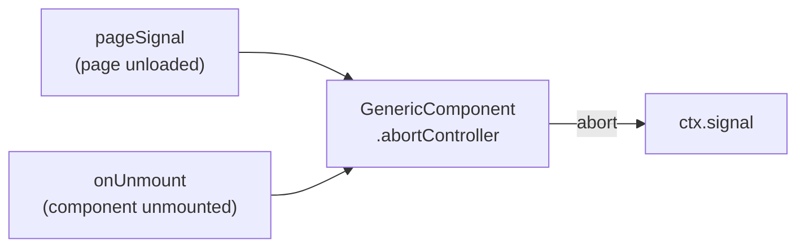
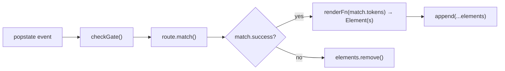

# Architecture

This document explains how rooted works internally. It is aimed at contributors and advanced users who want to understand the design decisions behind the library.

---

## Contents

- [Overview](#overview)
- [Component wrapper element](#component-wrapper-element)
- [CSS scoping](#css-scoping)
- [Security model](#security-model)
- [Signal lifecycle](#signal-lifecycle)
- [Development mode](#development-mode)
- [Router design](#router-design)

---

## Overview

A rooted application is a tree of native custom elements. The high-level view is:

```
application()
└── <r-->            ← GenericComponent wrapping the root Component
    ├── <r-->        ← child component
    │   └── <div>     ← plain DOM created by create()
    └── <r-->        ← another child component (e.g. the Router)
        └── <r-->    ← a gate component
            └── <r-->← the route's component
```

There is no virtual DOM. `create()` calls `document.createElement` directly. Components are connected to the document by appending the `<r-->` element to the tree; the browser's own custom-element lifecycle drives `onMount` and `onUnmount`.

---

## Component wrapper element

Every functional `Component` is wrapped in a `GenericComponent` — a custom element registered under the tag name `<r-->` (production) or `<rooted-component>` (development).

When `create(MyComponent)` or `append(MyComponent)` is called:

1. A new `GenericComponent` DOM element is created via `document.createElement`.
2. The component constructor and options are stored in a `WeakMap` (see [security model](#security-model)).
3. The element is returned (and, for `append`, immediately inserted into the host element).
4. When the browser connects the element, `connectedCallback` fires. It defers to `queueMicrotask` and only calls `onMount` when `isConnected` is still `true` — this skips spurious calls caused by DOM re-parenting (e.g. when a framework moves nodes between parents in the same tick).
5. `onMount` builds a `ComponentContext` with `append`, `create`, `signal`, and (if applicable) `options`, then calls `component.onMount(context)`.
6. On disconnect, `disconnectedCallback` fires. It similarly defers via `queueMicrotask` and only calls `onUnmount` when `isConnected` is still `false`. `onUnmount` aborts the component's `AbortController`.

**`display: contents`** — `GenericComponent` sets `display: contents !important` on itself so it is invisible to CSS layout. From a styling and layout perspective the component's children appear as direct children of the component's parent.

---

## CSS scoping

Each component's styles are isolated to its own DOM subtree using a unique attribute selector. The pipeline is:

### 1. Scope ID generation

When `component()` is called it computes a **stable, deterministic scope ID** using a seeded FNV-1a 64-bit hash of the component name:

```
"my-counter" → FNV-1a (seeded) → "r1a2b3c4d" (base-36, 8-14 chars)
```

The seed is a global counter that increments per call so that two components with the same `name` (which is warned about in development) still produce distinct IDs, preventing style collisions.

The ID is safe to cache across page loads because module evaluation order is stable and deterministic.

### 2. Attribute injection

When `onMount` runs, `GenericComponent` sets the scope ID as an empty attribute on itself:

```html
<rooted-component r1a2b3c4d data-component="my-counter">
  ...
</rooted-component>
```

### 3. Style injection

`applyStyles()` wraps the component's CSS string and injects a `<style>` tag into `document.head` — once per component per document, tracked via a `WeakMap<Document, WeakSet<ComponentConstructor>>`.

**Primary — `@scope`** (Chrome 118+, Firefox 128+, Safari 17.4+):

```css
@scope ([r1a2b3c4d]) {
  p { color: red; }
}
```

`@scope` limits style application strictly to descendants of the scoping element. Styles cannot leak out to siblings or ancestors.

**Fallback — CSS nesting** (Chrome 112+, Firefox 117+, Safari 16.5+):

```css
[r1a2b3c4d] {
  p { color: red; }
}
```

The browser desugars nested rules to `[r1a2b3c4d] p { color: red }` via the cascade. This is equivalent descendant scoping for the vast majority of use cases, though unlike `@scope` it is subject to specificity rules rather than a hard scope boundary.

Runtime detection (`new CSSStyleSheet().replaceSync('@scope {}')`) picks the strategy once at module load time.

---

## Security model

Component data (the constructor and the options object) is stored in a `WeakMap<GenericComponent, ComponentData>` rather than as JS properties on the DOM element.

**Why?** Properties assigned directly to a DOM element are visible in the browser's console via element inspection. Options objects may contain sensitive application data that should not be trivially readable by users opening DevTools on a production site.

With the `WeakMap` approach:
- The data is keyed on the DOM element itself, so it is garbage-collected automatically when the element is removed from the document.
- There is no public API to retrieve data from the store outside of rooted's own internals.
- The store is module-scoped — it is not attached to `window` or any other globally accessible object.

**In development**, `appendComponentMetaData()` additionally assigns a non-enumerable `dev` object to the element containing `name`, `options`, and `definedAt`, so they are accessible via `element.dev` in DevTools. This is intentionally disabled in production builds.

---

## Signal lifecycle

Every component receives a `signal` in its `ComponentContext`. That signal is the output of a per-component `AbortController` that is wired to two sources:



### `pageSignal`

A module-level `AbortController` listens to `pagehide`. It aborts **only** when `event.persisted === false` — i.e. the page is being torn down rather than entering the browser's back-forward cache (bfcache).

When a page enters the bfcache the JavaScript execution context is frozen and later thawed. Components should remain usable after a bfcache restore, so their signals must not abort prematurely. Using `pagehide` with the `persisted` guard correctly handles both cases.

### Component `AbortController`

`GenericComponent.onMount` creates a fresh `AbortController` every time it mounts (covering the remount case). It subscribes `pageSignal` to its own abort with the controller's own signal as the `abort` event listener's signal — meaning the page-signal listener is automatically removed on unmount, preventing memory leaks in long-lived single-page apps.

---

## Development mode

Rooted uses `import.meta.env.DEV` (set by Vite) to enable development-only behaviour. All dev utilities are tree-shaken out of production builds.

### Tag name

`GenericComponent.tagName` is `'rooted-component'` in development and `'r--'` in production. Human-readable tag names make the DOM tree far easier to understand in DevTools.

### `data-component` attribute

In development, `GenericComponent.onMount` sets a `data-component` attribute on each wrapper element:

```html
<rooted-component data-component="my-counter" r1a2b3c4d>
```

This makes the component name visible in the DevTools Elements panel without needing to read source maps.

### Source location tracking

When `component()` is called, `dev.appendSourceLocation()` parses the current call stack and records the file path and line number in the `definedAt` symbol property of the constructor. This value is surfaced in DevTools as `element.dev.definedAt` (via `appendComponentMetaData`) and in duplicate-name warnings.

### Component name validation

`dev.componentNameCheck()` runs once per `component()` call and:

1. Validates that the name is a legal HTML attribute name (used as a CSS attribute selector for scoping).
2. Checks for duplicates and logs a `console.warn` with the locations of all registered components sharing that name.

### Mount error rendering

If `onMount` throws (or its returned `Promise` rejects), rooted logs a `console.error` and, **in development only**, appends a `<pre role="alert">` element inside the component containing the error message. This makes mount failures immediately visible in the page rather than requiring the console to be open.

### Router dev warnings

The router dev helper adds an additional warning:

- **Duplicate route** — a route object registered under more than one key in `router({ ... })`. The duplicate is silently ignored (first-wins) but warned in development.

---

## Router design

The router is a plain `Component` that mounts all registered gates and independently manages the `home` and `notFound` components.

### Gates are self-managing

Each gate produced by `gate()` is itself a component. When it mounts, it attaches a `popstate` listener and calls its own `checkGate()` function:



This means the router doesn't need to know about URL changes — each gate reacts independently. The router is only responsible for:

1. Appending all gate components (which then self-manage).
2. Showing `home` when `location.pathname === '/'`.
3. Showing `notFound` when the path is not `/` and no gate matches.

### Gate identity and deduplication

Gates are compared by **object identity** (`===`). If the same gate object appears under multiple keys in the router config, only the first entry is used. This is intentional: when using the Vite manifest plugin, the aggregator re-exports all gates, and spreading the same module twice would otherwise register duplicate listeners.

### Parent → child token merging

When a child route interpolates a parent route (`route\`${ParentRoute}${token('id', Number)}/\``), the route matcher evaluates the parent pattern first and merges its tokens with the child's own tokens. The `resolve` function and the gate render function both receive a single flat dictionary containing all tokens from both levels.
